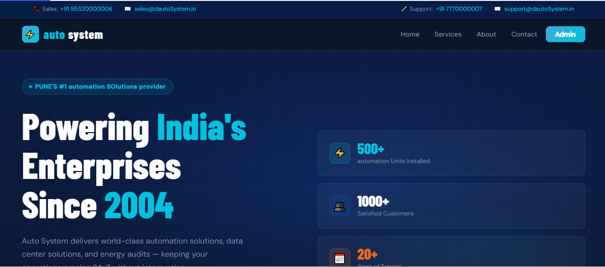
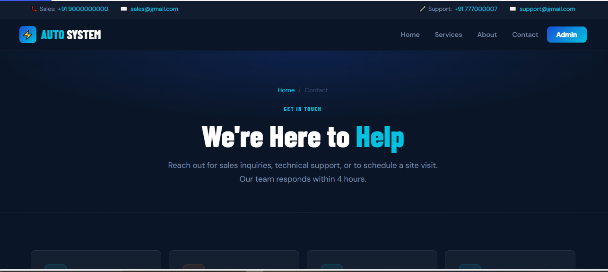
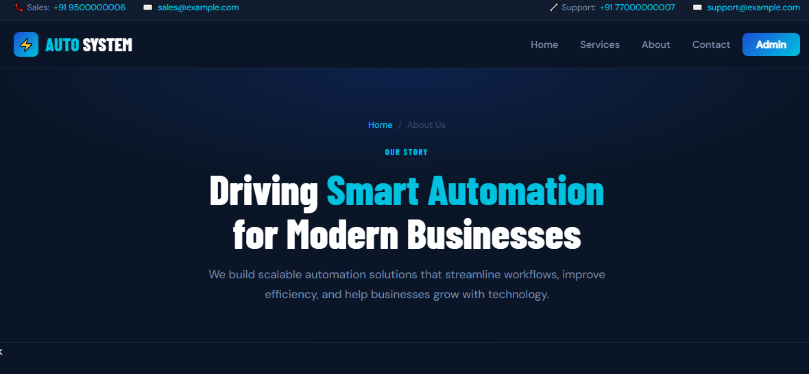
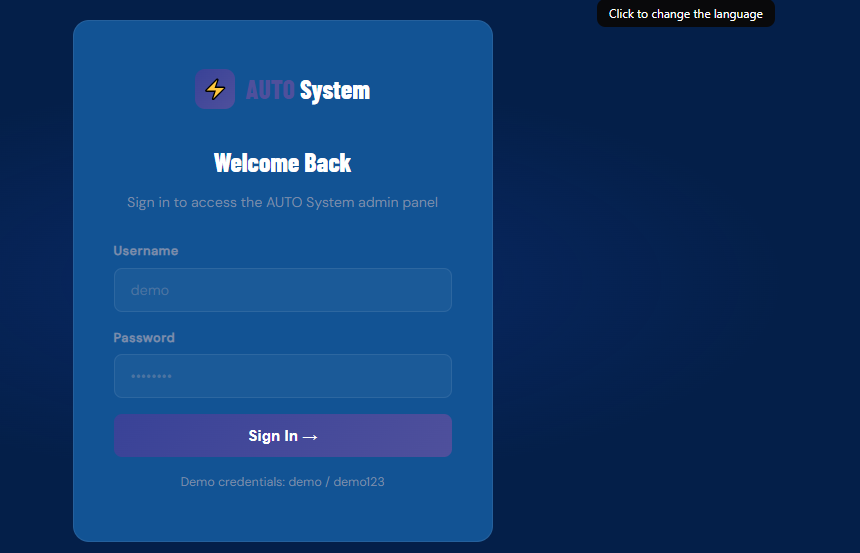
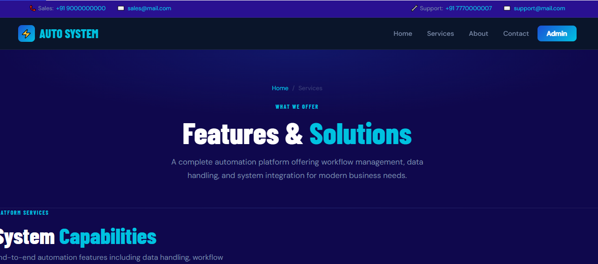

# 🚀 Business Automation Dashboard

A full-stack web application that automates business workflows by integrating data management, email notifications, and an admin dashboard.

---

## 📌 Overview

This project demonstrates how modern web technologies can be used to build an **automation system** that reduces manual effort and improves operational efficiency.

It allows users to submit data through a form, stores it in a database, and triggers automated email responses while providing an admin interface to manage and monitor data.

---

## ✨ Features

* 📥 **Contact Form Integration** – Capture user enquiries
* 📊 **Admin Dashboard** – View, manage, and delete records
* 📧 **Email Automation** – Send confirmation & notification emails
* 🗄️ **PostgreSQL Database** – Store and manage structured data
* ⚙️ **Automation Workflows** – Trigger actions based on events
* 🌐 **Responsive UI** – Clean frontend using HTML, CSS

---

## 🛠️ Tech Stack

* **Frontend:** HTML5, CSS3
* **Backend:** Python, Flask
* **Database:** PostgreSQL
* **Libraries:**

  * smtplib (Email sending)
  * pandas (Data handling)
  * psycopg2 (Database connection)

---

## ⚙️ Installation & Setup

### 1️⃣ Clone the repository

```bash
git clone https://github.com/your-username/your-repo-name.git
cd your-repo-name
```

---

### 2️⃣ Create virtual environment

```bash
python -m venv venv
venv\Scripts\activate   # Windows
```

---

### 3️⃣ Install dependencies

```bash
pip install -r requirements.txt
```

---

### 4️⃣ Configure environment variables

Create a `.env` file:

```env
EMAIL_USER=your_email@gmail.com
EMAIL_PASS=your_app_password
ADMIN_EMAIL=your_email@gmail.com

DB_HOST=127.0.0.1
DB_NAME=automation_db
DB_USER=postgres
DB_PASS=your_password
DB_PORT=5432
```

---

### 5️⃣ Run the application

```bash
python app.py
```

---

## 📂 Project Structure

business-automation-dashboard/
│
├── app.py                  # Main Flask application
├── email_sender.py         # Email automation logic
├── test_email.py           # Email testing script
│
├── templates/              # HTML templates (frontend views)
│   ├── base.html
│   ├── home.html
│   ├── about.html
│   ├── services.html
│   ├── contact.html
│   └── admin.html
│
├── static/                 # Static assets (CSS, JS, images)
│   └── style.css
|   |__Screenshots        #(screenshots of webpages)
|
├── .env                    # Environment variables (NOT uploaded)
├── .gitignore
└── README.md
---

## 🔐 Security Note

This project uses **environment variables** to store sensitive data.
No real credentials or production data are included in this repository.

---

## 📸 Screenshots


---## 📸 Screenshots

### 🏠 Home Page
company_website


### 📩 Contact Page


### 📊 About Dashboard


### ⚙️ Admin Panel


### 📩 Services



## 🚀 Future Improvements

* User authentication system
* Role-based access control
* AI-based email responses
* Deployment on cloud (Render / Railway)

---

## 🎯 Use Case

This project can be used for:

* Business enquiry management
* CRM automation
* Notification systems
* Data-driven dashboards

---

## 📄 Disclaimer

This project is a **generalized and sanitized version** of a real-world automation system.
All company-specific data, credentials, and sensitive information have been removed or replaced with placeholders.

---

## 👩‍💻 Author

**Deveshri Gurav**
Aspiring Data Analyst & Developer

---
